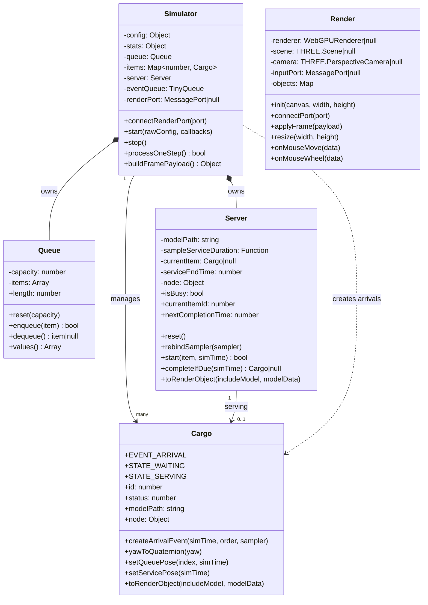

# microcityjs

## 代码结构

```text
microcityjs/
├─ index.html          # 主线程 UI 与交互入口：读取参数、启动/重启双 Worker、桥接鼠标与窗口缩放
├─ sim-worker.js       # 仿真 Worker：离散事件排队仿真、状态统计、向渲染 Worker 推送帧数据
├─ render-worker.js    # 渲染 Worker：Three.js + WebGPU 场景管理、对象插值动画、相机控制
├─ data/
│  └─ grid.csv         # 数据目录（当前代码主要从 data 下按需读取模型 json）
└─ README.md
```

### 文件职责

- `index.html`
	- 提供参数输入（到达率、服务率、队列容量、仿真时长）。
	- 创建 `sim-worker.js` 与 `render-worker.js`，通过 Comlink 暴露 API。
	- 建立 `MessageChannel`，把仿真帧从仿真 Worker 转发到渲染 Worker。
	- 把鼠标拖拽/滚轮事件桥接到渲染 Worker 相机控制。

- `sim-worker.js`
	- 维护事件队列（`TinyQueue`）并推进仿真时钟。
	- 管理服务台、等待队列、货物实体、统计信息。
	- 组装并发送 `frame` 消息，包含 `stats + objects`。

- `render-worker.js`
	- 初始化 WebGPU 渲染器、场景、相机、灯光与地面。
	- 接收 `frame`，创建/更新/销毁 Three.js 对象。
	- 处理轨道旋转、平移、缩放并执行插值动画。

## 类结构图（Mermaid）

